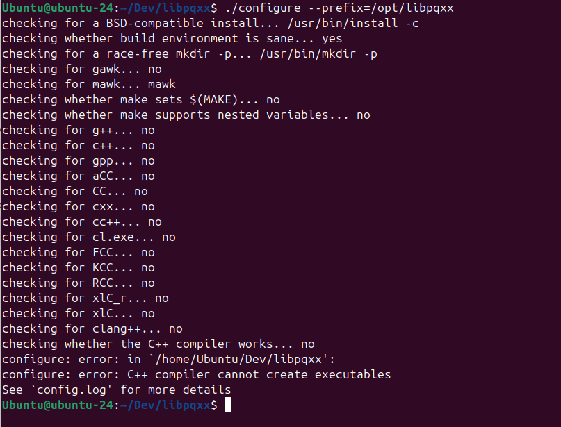
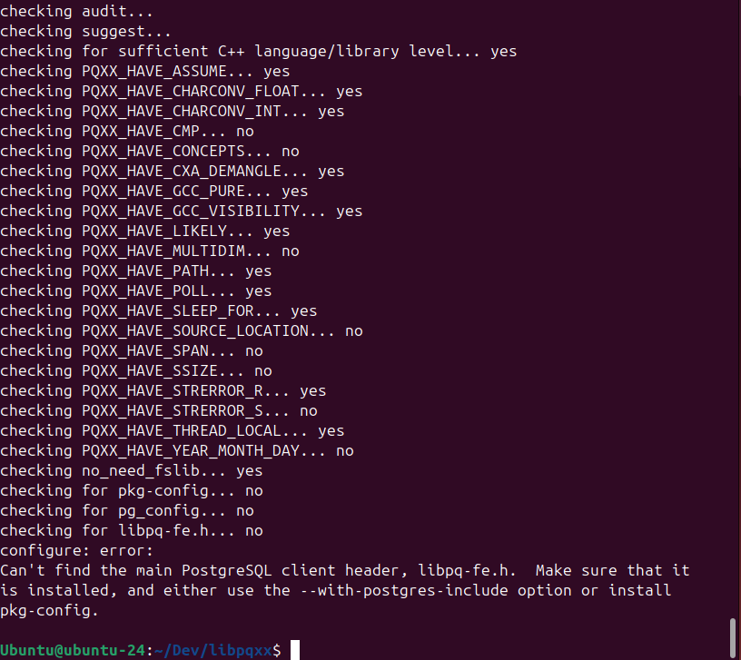
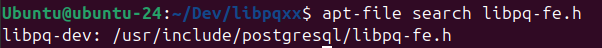
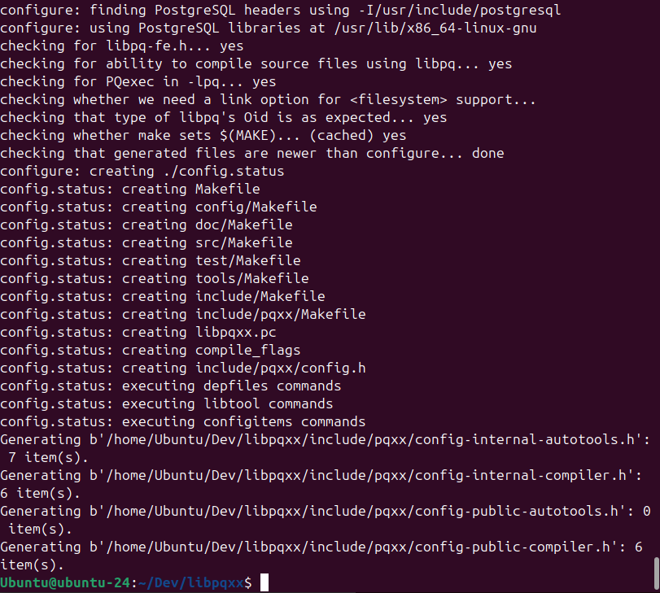
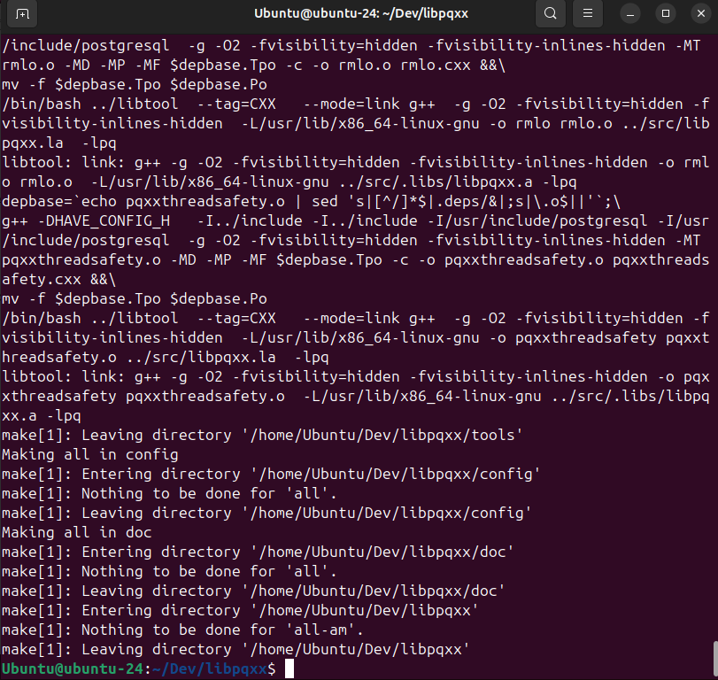
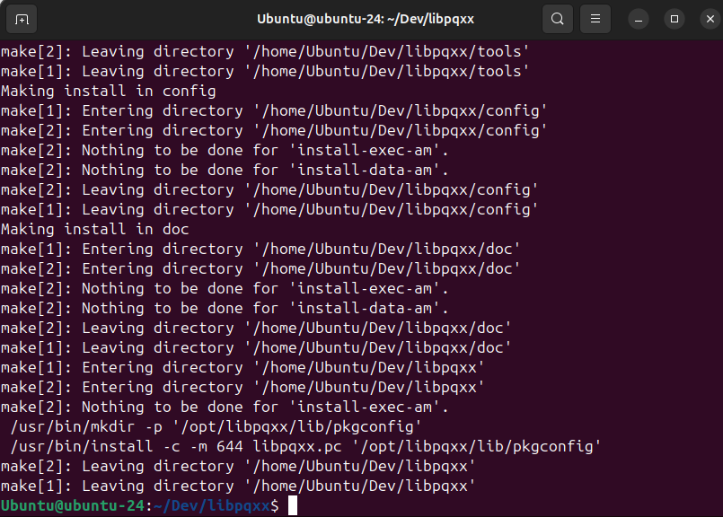
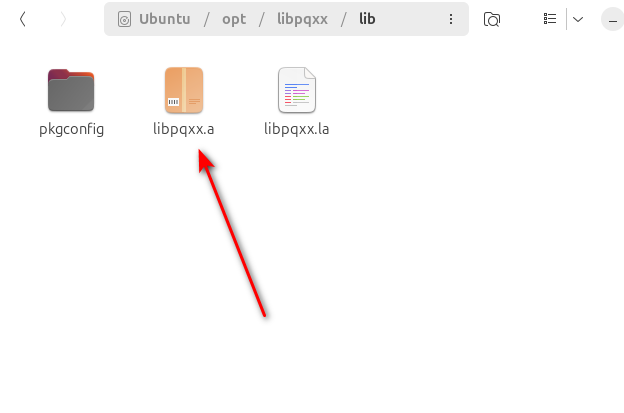

# libpqxx

* Цель: получить понимания configure, make и make install.
* Система: Ubuntu.

## link

* https://github.com/jtv/libpqxx/blob/master/BUILDING-configure.md
* https://github.com/autotools-mirror/automake/blob/master/INSTALL
* https://github.com/jtv/libpqxx/tree/master

* https://superuser.com/questions/360178/what-does-make-install-do  ???
* https://blog.drteam.rocks/2017/02/06/%D1%87%D0%B0%D1%80%D1%83%D1%8E%D1%89%D0%B0%D1%8F-%D0%BC%D0%B0%D0%B3%D0%B8%D1%8F-configure-make-%D0%B8-make-install/
* https://help.ubuntu.com/community/CompilingSoftware

Клонируем libpqxx

```bash
git clone https://github.com/jtv/libpqxx.git
```

```bash
./configure --prefix=/opt/libpqxx
```



```bash
sudo apt-get install build-essential
sudo apt install cmake
```



Теперь нудно отпределить, где содержится libpq-fe.h, которого нам нехватает

```bash
sudo apt install apt-file

sudo apt-file update

apt-file search libpq-fe.h
```



```bash
sudo apt install libpq-dev
```




```bash
make
```




```bash 
sudo make install
```







