# libpqxx

* Цель: получить понимания configure, make и make install.
* Система: Ubuntu.

## link

* https://github.com/jtv/libpqxx/blob/master/BUILDING-configure.md
* https://github.com/autotools-mirror/automake/blob/master/INSTALL
* https://github.com/jtv/libpqxx/tree/master

* https://superuser.com/questions/360178/what-does-make-install-do  ???
* https://blog.drteam.rocks/2017/02/06/%D1%87%D0%B0%D1%80%D1%83%D1%8E%D1%89%D0%B0%D1%8F-%D0%BC%D0%B0%D0%B3%D0%B8%D1%8F-configure-make-%D0%B8-make-install/
* https://help.ubuntu.com/community/CompilingSoftware


## begin

```bash 

sudo apt update

sudo apt-get install build-essential
sudo apt install cmake
```

* **build-essential** — базовые инструменты компиляции (gcc, g++, make и т.п.).


Прежде чем создавать и устанавливать библиотеку libpqxx, вам сначала нужно установить библиотеку libpq.
```bash
sudo apt install libpq-dev
```

* **libpq-dev** — это и есть dev-пакет libpq, содержащий заголовочные файлы и библиотеки, необходимые для сборки libpqxx

Клонируем libpqxx

```bash
git clone https://github.com/jtv/libpqxx.git
```

```bash
cd libpqxx
cd build
```

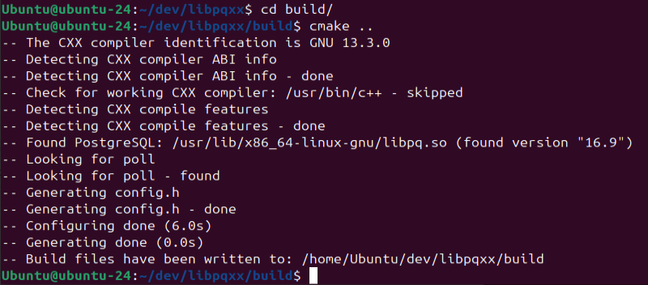

* **cmake ..** - Создать файлы сборки внутри build/ и Взять CMakeLists.txt из родительской директории (где он и находится)

```bash
make
```

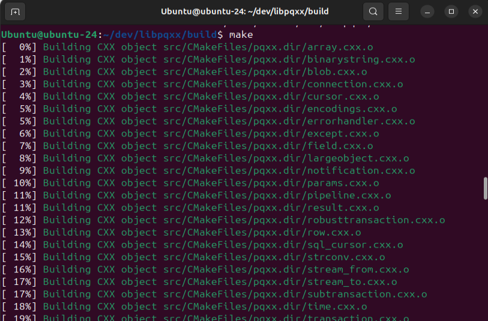
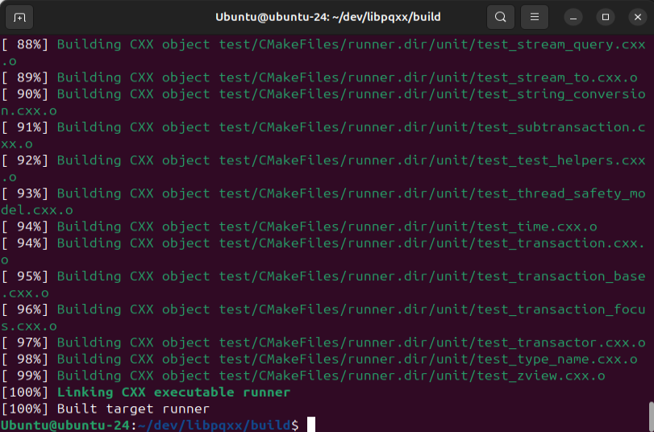


Рекомендуемый способ установки: 

```bash 
sudo checkinstall
```
Или, менее предпочтительно:
```bash 
sudo make install
```


```bash

sudo apt install checkinstall

```


```bash

sudo checkinstall

```


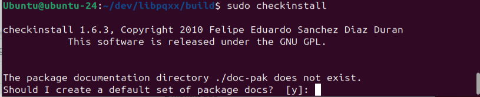

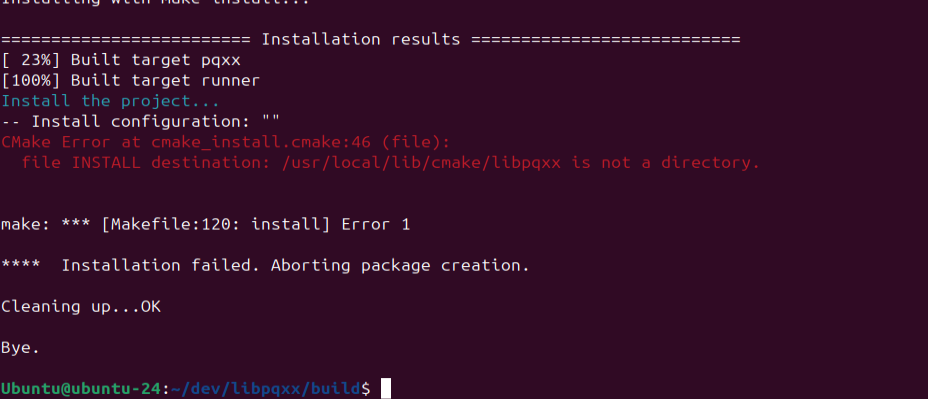


На данный момент ничего умнее, чем создайть нужный каталог вручную!

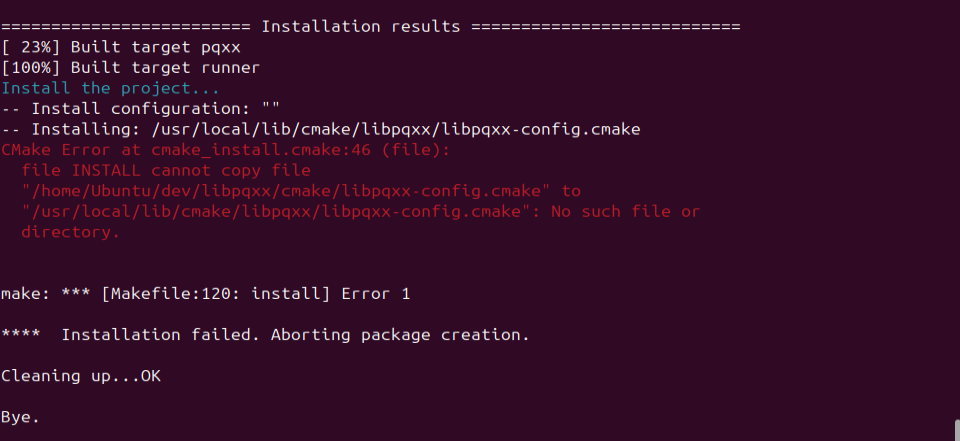

Видимо решение не очень, так как создавать файлы в ручную, плохая идея.

Будем делать Альтернативный путь.

Чтобы CMake не устанавливал что-либо в /usr/local, указажем собственный путь:

```bash
cmake -DCMAKE_INSTALL_PREFIX=/opt/libpqxx ..
```

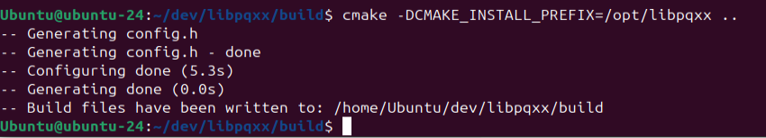


```bash
sudo checkinstall
```

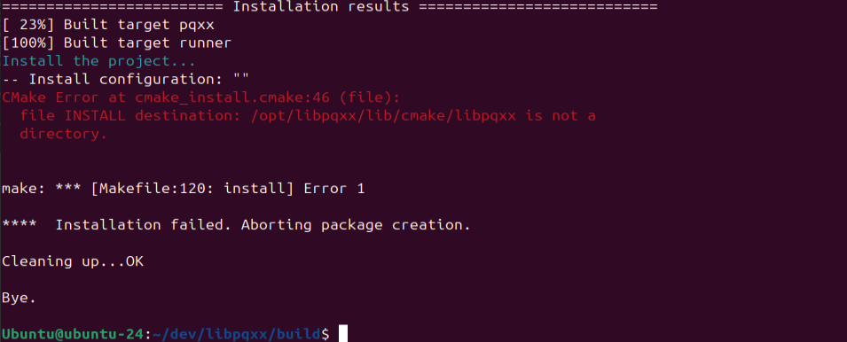

Не прокатило!

```bash
mkdir -p /opt/libpqxx/lib/cmake/libpxx
 mkdir -p /opt/libpqxx/lib/cmake
```


```bash
sudo apt install pkg-config
```


Копировать файлы лень, поиграем

```bash
cmake -DCMAKE_INSTALL_PREFIX=$HOME/.local ..
```

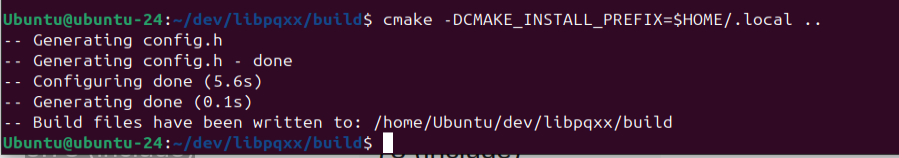


```bash
make
```
И снова приветики!!!
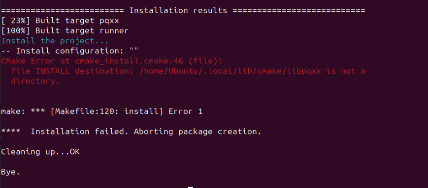


Воспользуемся 
```bash 
sudo make install
```
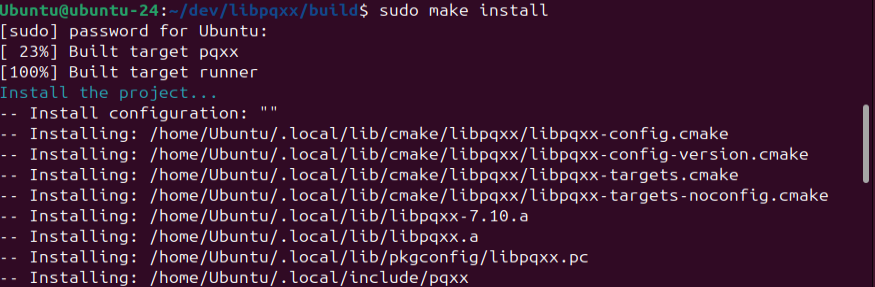

```bash
sudo checkinstall
```
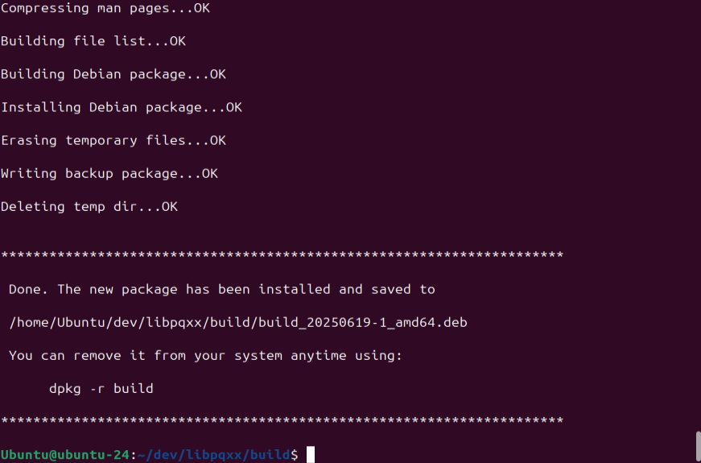


```bash
grep " install " /var/log/dpkg.log
```
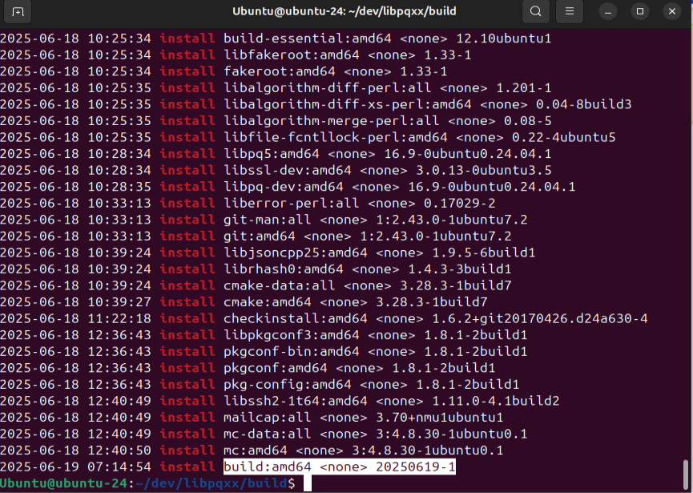


удаляем уствновленный, и создаем новый с нормальным именем


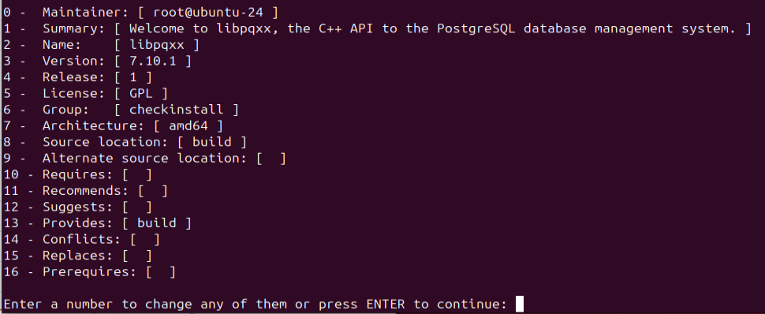

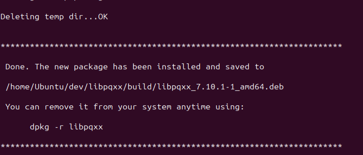


```bash
sudo apt install ./libpxx_7.10.1-1_amd.deb
```

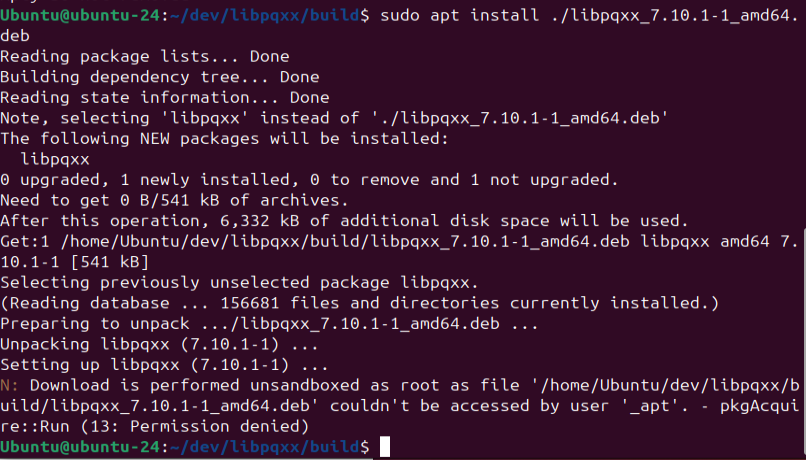


Проверим установлен покет 

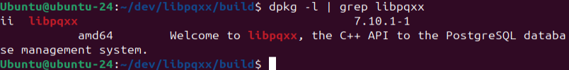

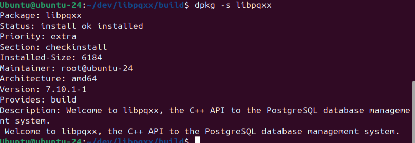


