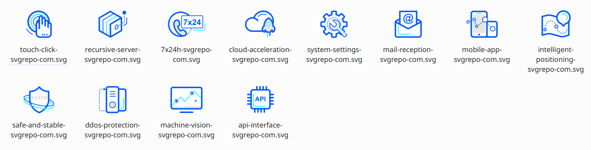
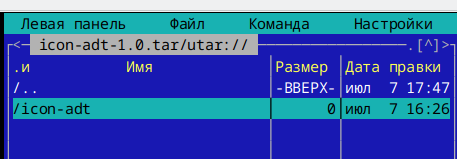

# Сборка RPM-пакета в Linux

[Rutube: Видео tutorial](https://rutube.ru/video/a4856d0947a59780448d63b5191b0280/)


## Рабочее пространство RPM 

```bash
apt-get install rpmdevtools rpm-build
```

Создадим рабочее пространство 

```bash
$ rpmdev-setuptree
```

Утилита создала, базовую структуру каталогов

```bash
$ tree ~/RPM/

/home/localadmin/RPM/
├── BUILD
├── RPMS
├── SOURCES
├── SPECS
└── SRPMS

```

Создадим папку проекта "icon-adt", icon-adt/themes/adt-module/scalable/ добавим сюда иконки




Создадим архив из каталога

```bash
tar cvf icon-adt-1.0.tar icon-adt

```

Теперь создадим spec файл

```
Name: icon-adt
Version: 1.0
Release: alt1

Summary: Icon themes for ADT BaseALT project
License: GPLv3+
Group: Other
Url: https://github.com/example/example

Source: %name-%version.tar
BuildArch: noarch

%description
Theme pack for BaseAlt ADT project by @example_name

%prep
%setup

%install
mkdir -p %buildroot%_datadir/%name
cp -R themes/*/ %buildroot%_datadir/%name

%files
%datadir/%name

%changelog

```


Перечень лицензий

```bash

cd /usr/share/license
ls
```

Посмотреть значение макросов

```bash
$ rpm --eval %buildroot%
/tmp/.private/localadmin/%{name}-buildroot%


```

changelog, можно заполнять вручную или с помощью утилиты add_changelog из rpm-utils

```bash
apt-get install rpm-utils

```

В домашней директории открываем файл .rpmmacros, можно открыть с помощью kwrite

```bash
kwrite ~/.rpmmacros
```

Заполняем своими данными
```
%_topdir	%homedir/RPM
#%_tmppath	%homedir/tmp

%packager	Joe Hacker <joe@email.address>
%_gpg_name	joe@email.address
```


```bash
add_changelog icon-adt.spec

```

Добавит %changelog

```
%changelog
* Mon Jul 07 2025 Joe Hacker <joe@email.address> 1.0-alt1
```

В spec закинем сделанный нами specfile

```
/home/localadmin/RPM/SPECS/
```

В SOURCES закиним наш архив icon-adt-1.0.tar

Запускаем сборку

```bash
rpmbuild -ba SPECS/icon-adt.spec
```

вылетает ошибка

```bash
$ rpmbuild -ba SPECS/icon-adt.spec 
Выполняется(%prep): /bin/sh -e /tmp/.private/localadmin/rpm-tmp.34289
+ umask 022
+ /bin/mkdir -p /home/localadmin/RPM/BUILD
+ cd /home/localadmin/RPM/BUILD
+ cd /home/localadmin/RPM/BUILD
+ rm -rf icon-adt-1.0
+ echo 'Source #0 (icon-adt-1.0.tar):'
Source #0 (icon-adt-1.0.tar):
+ /bin/tar -xf /home/localadmin/RPM/SOURCES/icon-adt-1.0.tar
+ cd icon-adt-1.0
/tmp/.private/localadmin/rpm-tmp.34289: line 129: cd: icon-adt-1.0: No such file or directory
ошибка: Неверный код возврата из /tmp/.private/localadmin/rpm-tmp.34289 (%prep)


Ошибки сборки пакетов:
    Неверный код возврата из /tmp/.private/localadmin/rpm-tmp.34289 (%prep)

```

данная ошибка говорит о том, что директория в архиве названа не верно,





Переименовал.
Запускаем.

```bash
rpmbuild -ba SPECS/icon-adt.spec 
```

```bash
Выполняется(%prep): /bin/sh -e /tmp/.private/localadmin/rpm-tmp.66048
+ umask 022
+ /bin/mkdir -p /home/localadmin/RPM/BUILD
+ cd /home/localadmin/RPM/BUILD
+ cd /home/localadmin/RPM/BUILD
+ rm -rf icon-adt-1.0
+ echo 'Source #0 (icon-adt-1.0.tar):'
Source #0 (icon-adt-1.0.tar):
+ /bin/tar -xf /home/localadmin/RPM/SOURCES/icon-adt-1.0.tar
+ cd icon-adt-1.0
+ /bin/chmod -c -Rf u+rwX,go-w .
+ exit 0
Выполняется(%install): /bin/sh -e /tmp/.private/localadmin/rpm-tmp.66048
+ umask 022
+ /bin/mkdir -p /home/localadmin/RPM/BUILD
+ cd /home/localadmin/RPM/BUILD
+ /bin/chmod -Rf u+rwX -- /tmp/.private/localadmin/icon-adt-buildroot
+ :
+ /bin/rm -rf -- /tmp/.private/localadmin/icon-adt-buildroot
+ PATH=/usr/libexec/rpm-build:/var/cache/ruby/gemie/bin:/var/cache/ruby/gemie/bin:/home/localadmin/bin:/usr/bin:/bin:/usr/local/bin:/usr/games
+ cd icon-adt-1.0
+ mkdir -p /tmp/.private/localadmin/icon-adt-buildroot/usr/share/icon-adt
+ cp -R themes/adt-module/ /tmp/.private/localadmin/icon-adt-buildroot/usr/share/icon-adt
+ /usr/lib/rpm/brp-alt
Cleaning files in /tmp/.private/localadmin/icon-adt-buildroot (auto)
Verifying and fixing files in /tmp/.private/localadmin/icon-adt-buildroot (binconfig,pkgconfig,libtool,desktop,gnuconfig)
Checking contents of files in /tmp/.private/localadmin/icon-adt-buildroot/ (default)
Compressing files in /tmp/.private/localadmin/icon-adt-buildroot (auto)
Verifying ELF objects in /tmp/.private/localadmin/icon-adt-buildroot (arch=normal,fhs=normal,lfs=relaxed,lint=relaxed,rpath=normal,stack=normal,textrel=normal,unresolved=normal)
Splitting links to aliased files under /{,s}bin in /tmp/.private/localadmin/icon-adt-buildroot
Processing files: icon-adt-1.0-alt1
Finding Provides (using /usr/lib/rpm/find-provides)
Executing: /bin/sh -e /tmp/.private/localadmin/rpm-tmp.pQ2MAF
find-provides: running scripts (alternatives,debuginfo,lib,pam,perl,pkgconfig,python,python3,shell)
Finding Requires (using /usr/lib/rpm/find-requires)
Executing: /bin/sh -e /tmp/.private/localadmin/rpm-tmp.giBSwy
find-requires: running scripts (cpp,debuginfo,files,lib,pam,perl,pkgconfig,pkgconfiglib,python,python3,rpmlib,shebang,shell,static,symlinks,systemd-services)
Wrote: /home/localadmin/RPM/SRPMS/icon-adt-1.0-alt1.src.rpm (w2.lzdio)
Wrote: /home/localadmin/RPM/RPMS/noarch/icon-adt-1.0-alt1.noarch.rpm (w2.lzdio)
```

Процесс сборки завершился успешно

В директории /RPM/RPMS/noarch/ появился файл icon-adt-1.0-alt1.noarch.rpm

