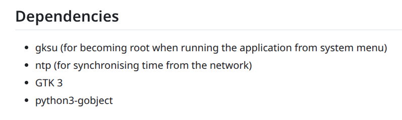
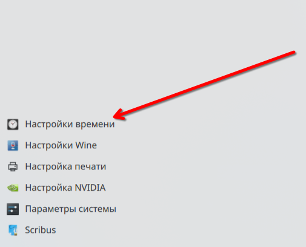
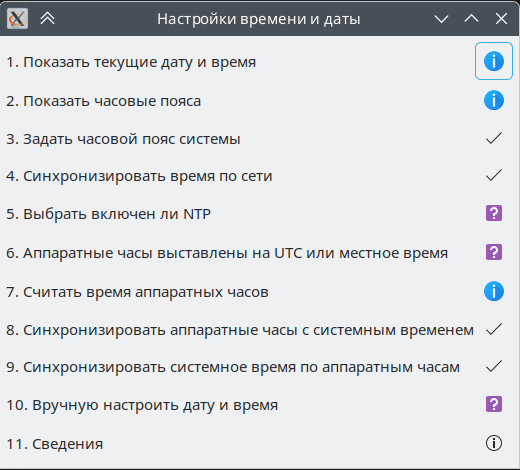

# Сборка RPM-пакета Python-проекта в ALT Linux

* [Видео rutube](https://rutube.ru/video/65f3d6fef277cf53c0a8392f250b7e48/)
* [bugzilla: Прошу собрать в репо инструмент работы с временем - timeset-gui](https://bugzilla.altlinux.org/50010)
* [github: timeset gui](https://github.com/abchk1234/timeset-gui)


Приступим

```bash
git clone https://github.com/abchk1234/timeset-gui.git
```

Переменуем нашу директорию

```bash
mv timeset-gui/ timeset-gui-2.5
```

делаем архив

```bash
tar cvf timeset-gui-2.5.tar.gz timeset-gui-2.5/

```

Закинем архив timeset-gui-2.5.tar.gz в каталог /RPM/SOURCES/ 

Создадим spec

```
Name: timeset-gui
Version: 2.5
Release: alt4

Summary: A GUI for managing system date and time
License: GPLv3
Group: System/Configuration/Other
Url: https://github.com/abchk1234/timeset-gui

Source0: %name-%version.tar.gz
Source1: org.xfce.pkexec.timeset-gui.policy
Source2: timeset-gui.rules
BuildArch: noarch

Requires:	sudo
Requires: python3-module-pygobject3
Requires: ntpdate
Requires: systemd

BuildRequires: rpm-build-python3

%description
Its a graphical interface written in python for managing system date and time.

%prep
ls -l
%setup 
sed -i -e 's|share/icons|share/pixmaps|' -e '/makefile/d' makefile

%build
%make_build

%install
%makeinstall_std
sed -i 's|Exec=gksudo|Exec=pkexec --user root|' %buildroot/%_datadir/applications/*.desktop

mkdir -p  %buildroot/usr/share/polkit-1/{actions,rules}/
cp %SOURCE1 %buildroot/usr/share/polkit-1/actions/
cp %SOURCE2 %buildroot/usr/share/polkit-1/rules/

%files
%_bindir/*
%_datadir/pixmaps/*.png
%_datadir/locale/*/LC_MESSAGES/*
%_datadir/applications/*.desktop
%_datadir/doc/%name
/usr/share/polkit-1/*


* Fri Jul 11 2025 Joe Hacker <joe@email.address> 2.5-alt4
- Add BuildRequires tag

```

Обращаю внимание файлы org.xfce.pkexec.timeset-gui.policy и timeset-gui.rules находятся по следующему пути assembly/files/06.building-RPM-package-python/


org.xfce.pkexec.timeset-gui.policy и timeset-gui.rules помещаем в /RPM/SOURCES/ 


## Рассмотрим timeset-gui.rules

```js
polkit.addRule(function(action, subject) {
    if (action.id == "org.xfce.pkexec.timeset-gui" ) {
        return polkit.Result.YES;
    };
});
```

По итогу, если пришел нужный id, то мы возвращаем polkit.Result.YES, что означает, что действие разрешено без дополнительных проверок.

То есть:

>Любой пользователь может запустить timeset-gui с правами root без запроса пароля. 

Предполагаю:

> Это потенциальная дыра в безопасности : любой залогиненный пользователь может изменять системное время.


## Рассмотрим org.xfce.pkexec.timeset-gui.policy
```

<?xml version="1.0" encoding="UTF-8"?>
<!DOCTYPE policyconfig PUBLIC
 "-//freedesktop//DTD PolicyKit Policy Configuration 1.0//EN"
 "http://www.freedesktop.org/standards/PolicyKit/1/policyconfig.dtd">
<policyconfig>
  <action id="org.xfce.pkexec.timeset-gui">
    <message>Authentication is NOT required to run timeset-gui</message>
    <icon_name>timeset-gui-icon</icon_name>
    <defaults>
      <allow_any>yes</allow_any>
      <allow_inactive>yes</allow_inactive>
      <allow_active>yes</allow_active>
    </defaults>
    <annotate key="org.freedesktop.policykit.exec.path">/usr/bin/timeset-gui</annotate>
    <annotate key="org.freedesktop.policykit.exec.allow_gui">true</annotate>
  </action>
</policyconfig> 
```

Это файл политики PolicyKit , определяющий, как пользователи могут запускать timeset-gui с повышенными привилегиями.

* allow_any: разрешить выполнение всем.
* allow_inactive: разрешить выполнение неактивным сеансам (например, из консоли).
* allow_active: разрешить выполнение активному пользователю.

Это означает: никакой аутентификации не требуется — любой пользователь может запустить timeset-gui с root-правами без ввода пароля

Ваш текущий .policy + .rules файлы вместе дают полный доступ без аутентификации к запуску timeset-gui с root-привилегиями.


## Зависимости



Пакет gksu удален из репозитория sisyphus [gksu](https://packages.altlinux.org/ru/sisyphus/srpms/gksu/) в место него будем использовать sudo

Устанавливаем нужные зависимости

```bash
apt-get install sudo python3-module-pygobject3 ntpdate systemd
```

## BuildRequires и Requires

BuildRequires - Что нужно для сборки пакета
Requires - Что нужно для установки и запуска пакета


## Пакет: rpm-build-python3
Вспомогательные макросы RPM для пересборки пакетов Python 3

**rpm-build-python3** предоставляет специальные макросы и инструменты, облегчающие сборку и пересборку пакетов, связанных с Python 3, в формате RPM. Он интегрируется с системой RPM и упрощает автоматизацию процессов, связанных с версиями Python, зависимостями и установкой модулей.

```bash
apt-get install rpm-build-python3
```

Добавим add_changelog timeset-gui.spec


Запускаем сборку пакета

```bash
$ rpmbuild -ba ~/RPM/SPECS/timeset-gui.spec

```

Пакет собрался и располагается ~/RPM/RPMS/noarch/timeset-gui-2.5-alt4.noarch.rpm


## Установим пакет timeset-gui-2.5-alt4.noarch.rpm

```bash

# rpm -i /home/localadmin/RPM/RPMS/noarch/timeset-gui-2.5-alt4.noarch.rpm

```

Теперь можем запустить 



Проверяем, все запустилось и сработало




### Удаление пакета

```bash

# apt-get remove имя_пакета

```

удаляет только указанный пакет , но не удаляет автоматически установленные зависимости , которые были поставлены вместе с ним.

Если необходимо удалить пакет и неиспользуемые зависимости, то

```bash

# apt-get remove имя_пакета
# apt-get autoremove

```

Просмотр недавно установленных пакетов
```bash
rpm -qa --last|head
```

Наш пакет называется timeset-gui-2.5-alt4.noarch


Удаляем наш пакет
```bash
# apt-get remove timeset-gui-2.5-alt4.noarch
# apt-get autoremove
```

Готово!
