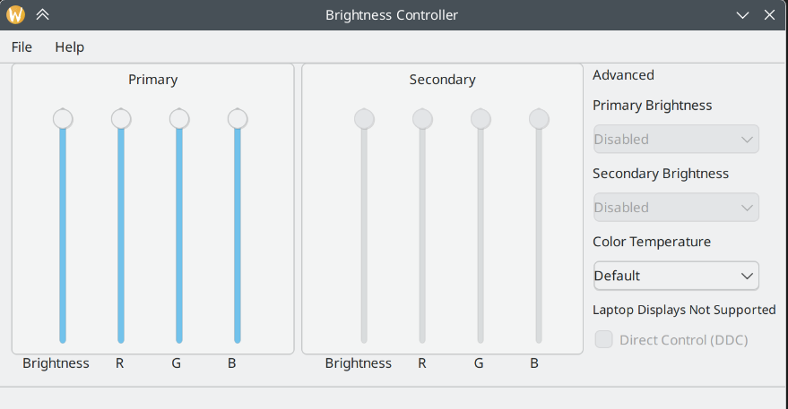

# Сборка RPM-пакета Python-проекта с помощью GEAR в ALT Linux


* [Видео rutube](https://rutube.ru/video/ffbd5432ca5f94b494f7d7472a97492c/)

* [bugzilla: Данная программ позволяет управлять яркостью мониторов стационарного ПК](https://bugzilla.altlinux.org/49904)
* [github: Brightness](https://github.com/LordAmit/Brightness)


```bash
git clone git@github.com:LordAmit/Brightness.git
```

В README описана установка с помощью Pip
С начала установим нужные пакетики

```bash
apt-get install ddcutil xrandr python3 python3-module-PyQt5 pip
```

Запускаем скрипт /home/localadmin/git/Brightness

```bash
pip install brightness-controller-linux
```

запускаем программу и смотрим, что работает

```bash
brightness-controller
```




