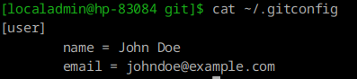
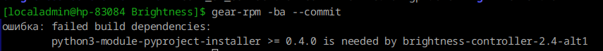
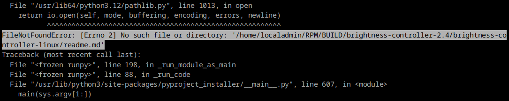
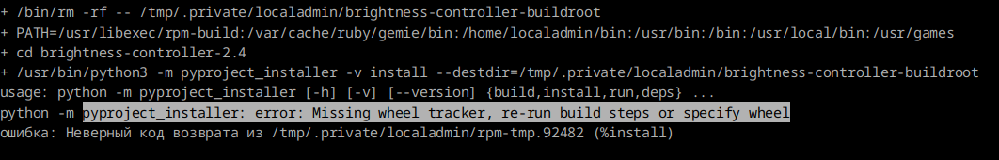
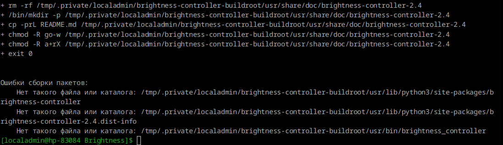
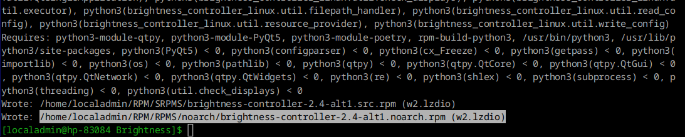

# Сборка RPM-пакета Python-проекта с помощью GEAR в ALT Linux


* [Видео rutube](https://rutube.ru/video/ffbd5432ca5f94b494f7d7472a97492c/)

* [bugzilla: Данная программ позволяет управлять яркостью мониторов стационарного ПК](https://bugzilla.altlinux.org/49904)
* [github: Brightness](https://github.com/LordAmit/Brightness)


```bash
git clone git@github.com:LordAmit/Brightness.git
```

В README описана установка с помощью Pip
С начала установим нужные пакетики

```bash
apt-get install ddcutil xrandr python3 python3-module-PyQt5 pip
```

Запускаем скрипт /home/localadmin/git/Brightness

```bash
pip install brightness-controller-linux
```

запускаем программу и смотрим, что работает

```bash
brightness-controller
```


При проверке на ноутбуке, программа запускается, но ничего не меняет.


Настроим git

```bash
$ git config --global user.name "John Doe"
$ git config --global user.email johndoe@example.com

```




```bash
apt-get install gear
```

Создадим инструкции для проекта
```bash
mkdir .gear
vim .gear/rules
cat .gear/rules
```
.gear/rules

```
tar: .
spec: .gear/brightness.spec

```

```bash
touch brightness.spec
```

```
.gear
├── brightness.spec
└── rules
```

brightness.spec
```
Name: brightness-controller
Version: 2.4
Release: alt1

Summary: Brightness Controller for Linux
License: GPLv3+
Group: Graphical desktop/GNOME
Url: https://github.com/LordAmit/Brightness

Source:%name-%version.tar
BuildArch: noarch


Requires: python3-module-qtpy
Requires: python3-module-PyQt5
Requires: python3-module-poetry
Requires: rpm-build-python3

%description
Using Brightness Controller? you can control brightness of both primary and external displays in Linux. Check it out!

%prep
%setup -q

%build
cd brightness-controller-linux/
%pyproject_build

%install
%pyproject_install

%files
%doc README.md
%python3_sitelibdir/%name
%python3_sitelibdir/%name-%version.dist-info
%_bindir/brightness_controller

%changelog
* Mon Jul 14 2025 Joe Hacker <joe@email.address> 2.4-alt1
- Initial build for ALT.
```


Выбор group

```
cat /usr/lib/rpm/GROUPS
```


Обрати внимание в файле brightness-controller-linux/pyproject.toml

описаны зависимости

```
[tool.poetry.dependencies]
python = "^3.8"
QtPy = "^2.2.0"
PyQt5 = {version = "^5.15"}
```


В секции **%prep** происходит распаковка архива с исходным кодом и формируется директория с исходными данными


**build** описывает сборку программы в подготовленом каталоге
Проект собирается по инструкции pyproject.toml черех модуль poetry
поэтому в секцию поместим макрос %pyproject_build 


```bash
rpm --eval %pyproject_build

        export CFLAGS="${CFLAGS:--O2 -g}" ; 
        export CXXFLAGS="${CXXFLAGS:--O2 -g}" ; 
        export FFLAGS="${FFLAGS:--O2 -g}" ; 

                /usr/bin/python3 -m pyproject_installer -v build

```

**%install** перенос файлов во временный каталог
%pyproject_install запускает утилиту python3 с ключом install и указывает путь к временному каталогу build-root

```bash
rpm --eval %pyproject_install

                /usr/bin/python3 -m pyproject_installer -v install --destdir=/tmp/.private/localadmin/%{name}-buildroot
```

секция %files содержит список файлов которые будут упакованы в rpm пакет и в дальнейшем установлены в систему


## После добавления spec и rules
Внесем изменения 

```bash
git add .gear/brightness.spec .gear/rules 
git add -f .gear/brightness.spec .gear/rules
```

## Сборка проверка spec-файла

```bash
$ gear-rpm -ba --commit
```



говорит, что нужно установить python3-module-pyproject-installer >= 0.4.0 is needed by brightness-controller-2.4-alt1


```bash
 apt-get install python3-module-pyproject-installer
```

хоть и ненаписано, но нужно установить и другие зависимости

```bash
apt-get install python3-module-qtpy python3-module-PyQt5 python3-module-poetry rpm-build-python3

```


Запускаем и видим следующее



Пишет, что ненайден файл readme.md
Проверяем и видим, что README написано заглавными буквами а в toml хочет строчными, для правки добавляем

```bash
mv README.md readme.md
```

Снова проблемка



снова файл pyproject.toml ищется в корне проекта

сделаем переход как и в секции build

```bash
%install
cd brightness-controller-linux/
%pyproject_install
```

Ошибка наименования каталога



добавим переменную oname

```
%define oname brightness_controller_linux

...

%files
%doc README.md
%python3_sitelibdir/%oname
%python3_sitelibdir/%oname-%version.dist-info
%_bindir/brightness_controller

```

Пакет rpm успешно записан




04:34