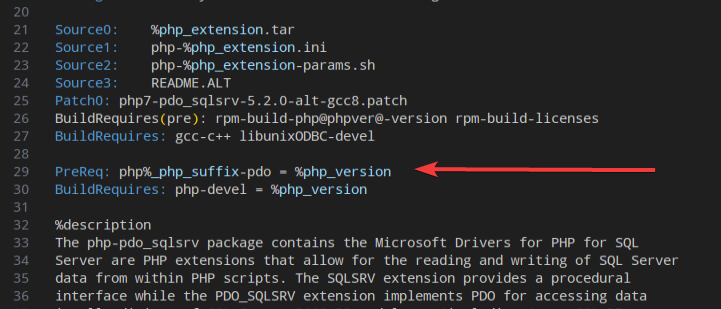
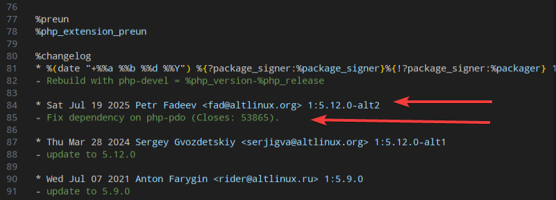
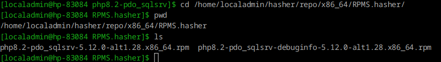
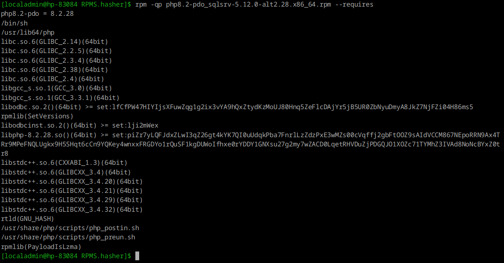

# Ошибка 53865 - Ошибка пакетирования php8.2-pdo 

* [bugzilla](https://bugzilla.altlinux.org/53865)


## Задача

У пакетов типа php8.2-pdo_sqlite есть зависимость на php8.2-pdo, в то время как у php8.2-pdo_sqlsrv таковой нету. 

Прошу проверить зависимости пакетов.


## Идеи решения

Предполагаю, что если зависимости у php8.2-pdo_sqlsrv нет, то стоит её добавить.

## Ссылки на пакеты packages.altlinux.org
* [php8.2-pdo_sqlite](https://packages.altlinux.org/ru/sisyphus/srpms/php8.2-pdo_sqlite/)
* [php8.2-pdo_sqlsrv](https://packages.altlinux.org/ru/sisyphus/srpms/php8.2-pdo_sqlsrv/)

## Ссылки Gear
* [php8.2-pdo_sqlite](https://git.altlinux.org/gears/p/php8.2-pdo_sqlite.git)
* [php8.2-pdo_sqlsrv](https://git.altlinux.org/gears/p/php8.2-pdo_sqlsrv.git)


## Приступаем

Клонируем, и смотрим spec.

Рассмотрев php-pdo_sqlite.spec обнаружено следующие связи с pdo, обнаружено следующее


```
BuildRequires: php%_php_suffix-pdo-devel = %php_version

PreReq: php%_php_suffix-pdo = %php_version
Provides: php%_php_suffix-pdo-driver
```

Предполагаю, что в нашей ситуации стоит обратить внимание на предварительное требование (PreReq)

```
PreReq: php%_php_suffix-pdo = %php_version
```

Теперь добавим  ```PreReq: php%_php_suffix-pdo = %php_version``` в php-pdo_sqlsrv.spec и попробуем собрать.



и добавим запись в changelog




Рузельтат файла spec [php-pdo_sqlsrv.spec](./files/10/php-pdo_sqlsrv.spec)

 ### Сборка

 ```bash
$ cd php8.2-pdo_sqlsrv/
$ gear-hsh
gear: specsubst directive requires a tag
 ```

## info
Данное сообщение говорит о том, что присутствует specbust, но для неё не указан нужный "тег"

* [Gear/specsubst](https://www.altlinux.org/Gear/specsubst)

Подстановка значения осуществляется при создании тега, в теле описания тега (-m):
```bash
gear-create-tag -f -n 8.2.28-alt2 -m "8.2.28-alt2
X-gear-specsubst: phpver=8.2" -u 98619CAED63A85D9
```
Обратите внимание на то, что команда gear-create-tag идёт в две строки. Во второй строке задаётся собственно значение подставляемого параметра:


```bash
gpg --list-secret-keys
/home/fad/.gnupg/secring.gpg
----------------------------
sec   4096R/D63A85D9 2025-05-30
uid                  Petr Fadeev (ALT Linux) <fad@altlinux.org>
ssb   4096R/244A525B 2025-05-30
```

D63A85D9 — это short key ID (8 символов)


keyid стоит указывать тот, который был сгенерирован для Join. Посмотреть его можно командой
```bash
gpg --list-secret-keys --keyid-format=long

-----------------------------------
sec   4096R/98619CAED63A85D9 2025-05-30
uid                          Petr Fadeev (ALT Linux) <fad@altlinux.org>
ssb   4096R/DB09B36D244A525B 2025-05-30

```

 ### Сборка (продолжаем)

```bash
git status

...
modified:   php-pdo_sqlsrv.spec

git add php-pdo_sqlsrv.spec

git commit -m "fixed dependency on php-pdo"
[sisyphus 6a1a4ae] fixed dependency on php-pdo
 1 file changed, 4 insertions(+)
```


```bash
gear-create-tag -f -n 8.2.28-alt2 -m "8.2.28-alt2
X-gear-specsubst: phpver=8.2" -u 98619CAED63A85D9
```

```bash
gear-hsh -t 8.2.28-alt2
```




косяк, нужно поправить

```bash
Release:	alt2.%_php_release_version
```


Появился php8.2-pdo_sqlsrv-5.12.0-alt1.28.x86_64.rpm

```bash
[~]$ cd /home/localadmin/hasher/repo/x86_64/RPMS.hasher/
[RPMS.hasher]$ ls
php8.2-pdo_sqlsrv-5.12.0-alt1.28.x86_64.rpm  php8.2-pdo_sqlsrv-debuginfo-5.12.0-alt1.28.x86_64.rpm
php8.2-pdo_sqlsrv-5.12.0-alt2.28.x86_64.rpm  php8.2-pdo_sqlsrv-debuginfo-5.12.0-alt2.28.x86_64.rpm
[localadmin@hp-83084 RPMS.hasher]$ 

```

### Сделаем анализ RPM-пакета

```bash
rpm -qp php8.2-pdo_sqlsrv-5.12.0-alt2.28.x86_64.rpm --requires
```




По первой строче ```php8.2-pdo = 8.2.28```, что зависимость появилась.

# замечания

* Во-первых, просили проверить, а не добавлять зависимости. Нужна ли эта
зависимость этому пакету? Ты начинаешь действовать в предположении, что
нужна, но справидливо ли это предположение?

* Во-вторых, хотелось бы понять, чем PreReq отличается от Requires,
и зачем там именно PreReq.

* В-третьих, у gear-create-tag есть ключ `-s` AKA `--specsubst`,
удобнее и в целом лучше пользоваться им. Я правда только что
дописал про него на https://www.altlinux.org/Gear/specsubst,
можно улучшить описание и там.

* И, наконец, про changelog. Мейнейнер в последнее время добавляет
записи с маленькой буквы и без точки на конце. Рекомендуется
"не нарушать это единообразие": https://www.altlinux.org/Руководство_по_написанию_changelog#Лучшие_практики_оформления_changelog

* И изменение не исправляет, а добавляет зависимость. То есть,
я бы написал "add missing dependency" вместо "fix depednency".

* А ещё в сохранёнках в твоей записи changelog'а остался alt1.
Релиз с изменением не должен быть таким же, как у предыдущей
записи.

* А ещё я бы указал, что это NMU (см https://www.altlinux.org/NMU,
особенно раздел "Технологические требования к NMU").


