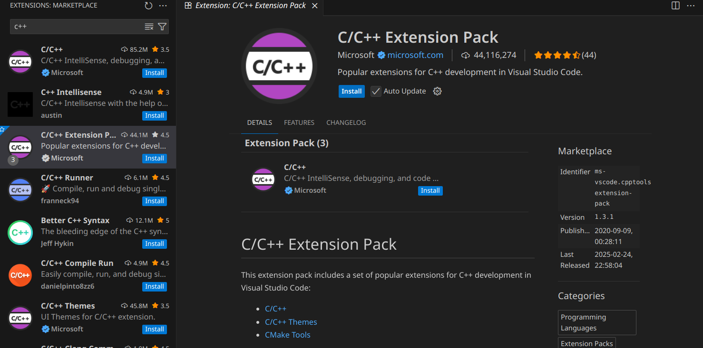

# Установка компилятора C/C++, CMake и первого простого проекта на C++ в Alt Linux

```bash
    apt-get install update
```

## Установка компилятора C

```bash
    apt-get install gcc
```

## Установка компилятора C++

```bash
    apt-get install gcc-c++
```

## Установка Cmake


```bash
    apt-get install cmake
```

## Установка отладчика Cmake
```bash
    apt-get install cmake gdb
```

## Установка VSCode

```bash
    apt-get install eepm
    epm play code
```
После завершения установки пакета code, можно запустить его через команду
```bash
    code
```

## Установка плагинов VSCode

* C/C++ Extension Pack

Пакет расширений C/C++ Extension Pack содержит расширения, которых достаточно для начала программирования на c++

