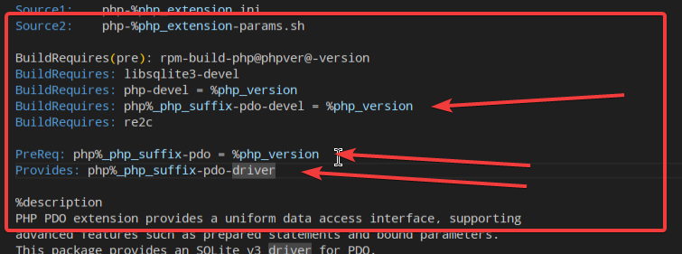

# Ошибка 53865 - Ошибка пакетирования php8.2-pdo 

* [bugzilla](https://bugzilla.altlinux.org/53865)


## Задача

У пакетов типа php8.2-pdo_sqlite есть зависимость на php8.2-pdo, в то время как у php8.2-pdo_sqlsrv таковой нету. 

Прошу проверить зависимости пакетов.


## замечания к <a href="09.bugzilla-53865.md">v1</a>


* > Во-первых, просили проверить, а не добавлять зависимости. Нужна ли эта зависимость этому пакету? Ты начинаешь действовать в предположении, что нужна, но справидливо ли это предположение?

Оба пакета должны иметь зависимость по следующим соображениям:

* **PDO — это базовый слой, а pdo_sqlite и pdo_sqlsrv — драйверы PDO**
PDO (PHP Data Objects) — это абстрактный интерфейс доступа к базам данных. Конкретные драйверы (pdo_sqlite, pdo_mysql, pdo_sqlsrv и т.д.) расширяют функциональность PDO, но не заменяют его.

PDO-драйверы не могут работать без основного модуля pdo.


* > Во-вторых, хотелось бы понять, чем PreReq отличается от Requires,и зачем там именно PreReq.

Информации про PreReq на https://www.altlinux.org/Spec не обнаружил.


**PreReq** - гарантирует установки до данного пакета.

на данный момент PreReq считается устаревшей директивой.

В современных версиях RPM разница между PreReq и Requires практически исчезла — и в большинстве случаев PreReq ведёт себя точно так же, как Requires.

По прочитаной информации пришел к выводу, что использовать PreReq - неактуально.


**Делаю вывод, что для современных реалиев лучше написать Requires.**


* > В-третьих, у gear-create-tag есть ключ `-s` AKA `--specsubst`,
удобнее и в целом лучше пользоваться им. Я правда только что
дописал про него на https://www.altlinux.org/Gear/specsubst,
можно улучшить описание и там.


* > И, наконец, про changelog. Мейнейнер в последнее время добавляет
записи с маленькой буквы и без точки на конце. Рекомендуется
"не нарушать это единообразие": https://www.altlinux.org/Руководство_по_написанию_changelog#Лучшие_практики_оформления_changelog

* > И изменение не исправляет, а добавляет зависимость. То есть,
я бы написал "add missing dependency" вместо "fix depednency".

* > А ещё в сохранёнках в твоей записи changelog'а остался alt1.
Релиз с изменением не должен быть таким же, как у предыдущей
записи.

* > А ещё я бы указал, что это NMU (см https://www.altlinux.org/NMU,
особенно раздел "Технологические требования к NMU").


## Ссылки на пакеты packages.altlinux.org
* [php8.2-pdo_sqlite](https://packages.altlinux.org/ru/sisyphus/srpms/php8.2-pdo_sqlite/)
* [php8.2-pdo_sqlsrv](https://packages.altlinux.org/ru/sisyphus/srpms/php8.2-pdo_sqlsrv/)

## Ссылки Gear
* [php8.2-pdo_sqlite](https://git.altlinux.org/gears/p/php8.2-pdo_sqlite.git)
* [php8.2-pdo_sqlsrv](https://git.altlinux.org/gears/p/php8.2-pdo_sqlsrv.git)

Клонируем, и смотрим spec.

Рассмотрев php-pdo_sqlite.spec обнаружено следующие связи с pdo, обнаружено следующее



```
BuildRequires: php%_php_suffix-pdo-devel = %php_version

PreReq: php%_php_suffix-pdo = %php_version
Provides: php%_php_suffix-pdo-driver
```

Предполагаю, что в нашей ситуации стоит обратить внимание на предварительное требование (PreReq)

```
PreReq: php%_php_suffix-pdo = %php_version
```

В место **PreReq** будем использовать **Requires**, так как использовать PreReq в современных версиях RPM - неактуально..

Теперь добавим  ```Requires: php%_php_suffix-pdo = %php_version``` в php-pdo_sqlsrv.spec и попробуем собрать.


Оригинальный файлс
php-pdo_sqlite-orig.spec


