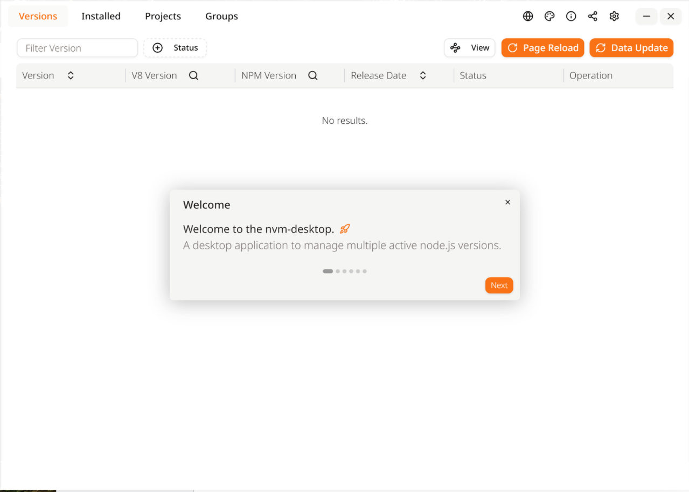
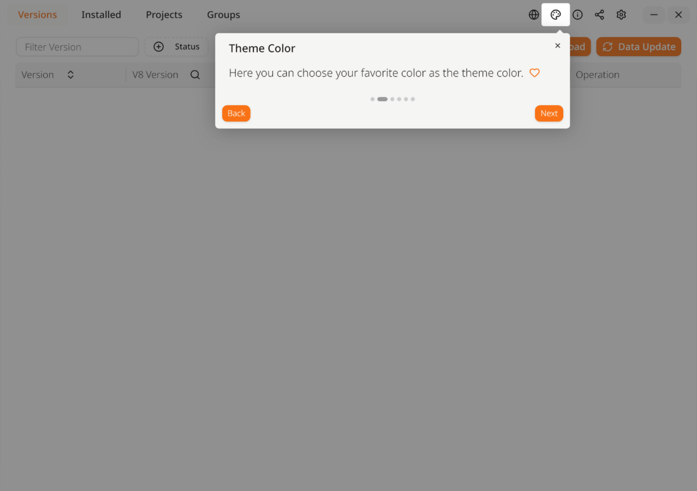
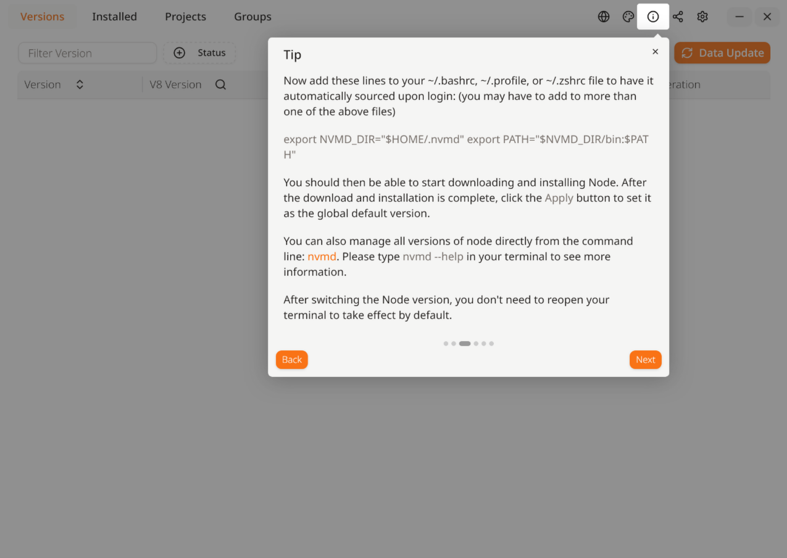
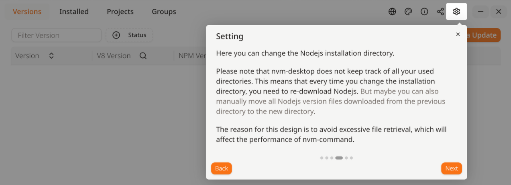
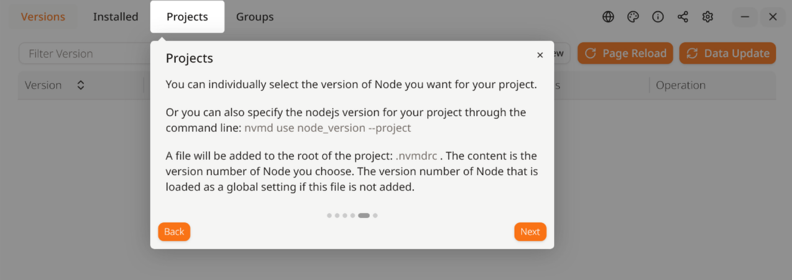

# nvm-desktop

* [link github](https://github.com/1111mp/nvm-desktop)
* LICENSE : GNU General Public License v3.0
* [releases](https://github.com/1111mp/nvm-desktop/releases)

## Install NVM.Desktop-4.1.2-1.x86_64.rpm

```bash
# root
rpm -ivh NVM.Desktop-4.1.2-1.x86_64.rpm 
ошибка: Неудовлетворенные зависимости:
        libappindicator3.so.1()(64bit) нужен для nvm-desktop-0:4.1.2-1.x86_64
```

* [libappindicator-gtk3](https://packages.altlinux.org/ru/sisyphus/binary/libappindicator-gtk3/x86_64/)

```bash
# root
apt-get install libappindicator-gtk3
```


**Добро пожаловать!**
Добро пожаловать в nvm-desktop — настольное приложение для управления несколькими активными версиями Node.js.




**Цвет темы**
Здесь вы можете выбрать свой любимый цвет в качестве цвета темы.



**Совет**
Теперь добавьте следующие строки в файл ~/.bashrc, ~/.profile или ~/.zshrc, чтобы они автоматически подгружались при входе в систему (возможно, потребуется добавить их в более чем один из перечисленных файлов):

```bash
export NVMD_DIR="$HOME/.nvmd"
export PATH="$NVMD_DIR/bin:$PATH"
```

После этого вы сможете начать загрузку и установку Node.js. Как только загрузка и установка завершатся, нажмите кнопку «Применить», чтобы установить эту версию как глобальную по умолчанию.

Вы также можете управлять всеми версиями Node.js прямо из командной строки с помощью команды ```nvmd```. Для получения дополнительной информации введите в терминале: ```nvmd --help```.

После переключения версии Node.js вам не нужно перезапускать терминал — изменения вступят в силу автоматически.



**Настройки**
Здесь вы можете изменить каталог установки Node.js.
Обратите внимание, что nvm-desktop не отслеживает все ранее использованные вами каталоги. Это означает, что каждый раз при смене каталога установки вам придётся заново загружать Node.js. Однако вы также можете вручную переместить все файлы ранее загруженных версий Node.js из старого каталога в новый.
Такой подход был выбран специально, чтобы избежать чрезмерного сканирования файлов, что могло бы негативно сказаться на производительности команды nvm.



**Проекты**

Вы можете индивидуально выбрать нужную версию Node.js для своего проекта.
Также вы можете указать версию Node.js для проекта через командную строку:
```bash
nvmd use node_version --project
```

В корневой каталог проекта будет добавлен файл **.nvmdrc**, содержащий номер выбранной вами версии Node.js. Если этот файл отсутствует, будет использоваться версия Node.js, установленная в качестве глобальной по умолчанию.

